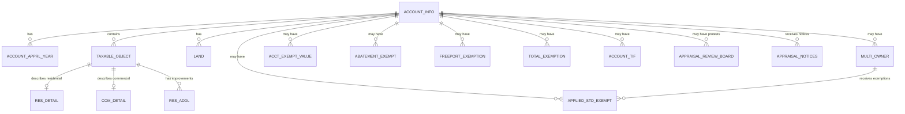

# DCAD Appraisal Database Entity Relationship Diagram

## Overview
The DCAD (Dallas Central Appraisal District) database contains property appraisal data organized into 16 interconnected tables. The database tracks property information, ownership, values, exemptions, tax-related data, property tax protests, and appraisal notices.

## Core Entities

### 1. ACCOUNT_INFO (Property & Owner Information)
**Primary Key**: `ACCOUNT_NUM`, `APPRAISAL_YR`

| Column | Type | Description |
|--------|------|-------------|
| ACCOUNT_NUM | String | Unique property account identifier |
| APPRAISAL_YR | Year | Appraisal year |
| OWNER_NAME1, OWNER_NAME2 | String | Primary owner names |
| BIZ_NAME | String | Business name (if applicable) |
| OWNER_ADDRESS_* | String | Owner mailing address fields |
| STREET_NUM, FULL_STREET_NAME | String | Property street address |
| PROPERTY_CITY, PROPERTY_ZIPCODE | String | Property location |
| LEGAL1-5 | String | Legal description |
| DEED_TXFR_DATE | Date | Deed transfer date |
| GIS_PARCEL_ID | String | GIS parcel identifier |

### 2. ACCOUNT_APPRL_YEAR (Annual Appraisal Values)
**Primary Key**: `ACCOUNT_NUM`, `APPRAISAL_YR`
**Foreign Key**: References `ACCOUNT_INFO`

| Column | Type | Description |
|--------|------|-------------|
| IMPR_VAL | Currency | Improvement value |
| LAND_VAL | Currency | Land value |
| TOT_VAL | Currency | Total market value |
| CITY_TAXABLE_VAL | Currency | Taxable value for city |
| COUNTY_TAXABLE_VAL | Currency | Taxable value for county |
| ISD_TAXABLE_VAL | Currency | Taxable value for school district |
| *_JURIS_DESC | String | Jurisdiction descriptions |
| *_SPLIT_PCT | Percent | Jurisdiction split percentages |

### 3. TAXABLE_OBJECT (Property Component Mapping)
**Primary Key**: `ACCOUNT_NUM`, `APPRAISAL_YR`, `TAX_OBJ_ID`
**Foreign Key**: `ACCOUNT_NUM`, `APPRAISAL_YR` references `ACCOUNT_INFO`

Links accounts to specific taxable objects (buildings, improvements).

### 4. RES_DETAIL (Residential Property Details)
**Primary Key**: `ACCOUNT_NUM`, `APPRAISAL_YR`, `TAX_OBJ_ID`
**Foreign Key**: References `TAXABLE_OBJECT`

| Column | Type | Description |
|--------|------|-------------|
| BLDG_CLASS_DESC | String | Building classification |
| YR_BUILT, EFF_YR_BUILT | Year | Construction years |
| TOT_LIVING_AREA_SF | Number | Total living area |
| NUM_BEDROOMS, NUM_*_BATHS | Number | Room counts |
| HEATING_TYP_DESC, AC_TYP_DESC | String | HVAC types |
| POOL_IND, SPA_IND | Boolean | Amenity indicators |

### 5. COM_DETAIL (Commercial Property Details)
**Primary Key**: `TAX_OBJ_ID`, `ACCOUNT_NUM`, `APPRAISAL_YR`
**Foreign Key**: References `TAXABLE_OBJECT`

| Column | Type | Description |
|--------|------|-------------|
| PROPERTY_NAME | String | Property name |
| GROSS_BLDG_AREA | Number | Gross building area |
| NET_LEASE_AREA | Number | Leasable area |
| NUM_UNITS | Number | Number of units |
| IMP_VAL, LAND_VAL, MKT_VAL | Currency | Value components |

### 6. LAND (Land Parcels)
**Primary Key**: `ACCOUNT_NUM`, `APPRAISAL_YR`, `SECTION_NUM`
**Foreign Key**: `ACCOUNT_NUM`, `APPRAISAL_YR` references `ACCOUNT_INFO`

| Column | Type | Description |
|--------|------|-------------|
| SPTD_CD, SPTD_DESC | String | State property type code |
| ZONING | String | Zoning designation |
| AREA_SIZE | Number | Parcel area |
| VAL_AMT | Currency | Land value |
| AG_USE_IND | Boolean | Agricultural use indicator |

### 7. RES_ADDL (Additional Residential Improvements)
**Primary Key**: `ACCOUNT_NUM`, `APPRAISAL_YR`, `TAX_OBJ_ID`, `SEQ_NUM`
**Foreign Key**: References `TAXABLE_OBJECT`

Tracks garages, pools, outbuildings, and other improvements.

## Ownership & Multi-Owner Support

### 8. MULTI_OWNER
**Primary Key**: `APPRAISAL_YR`, `ACCOUNT_NUM`, `OWNER_SEQ_NUM`
**Foreign Key**: `ACCOUNT_NUM`, `APPRAISAL_YR` references `ACCOUNT_INFO`

Handles properties with multiple owners and their ownership percentages.

## Exemption Tables

### 9. APPLIED_STD_EXEMPT (Standard Exemptions)
**Primary Key**: `ACCOUNT_NUM`, `APPRAISAL_YR`, `OWNER_SEQ_NUM`
**Foreign Key**: References `ACCOUNT_INFO` and `MULTI_OWNER`

Tracks homestead, over-65, disabled, and veteran exemptions with ceiling values.

### 10. ACCT_EXEMPT_VALUE (Exemption Values by Type)
**Primary Key**: `ACCOUNT_NUM`, `APPRAISAL_YR`, `EXEMPTION_CD`
**Foreign Key**: `ACCOUNT_NUM`, `APPRAISAL_YR` references `ACCOUNT_INFO`

Stores exemption amounts by jurisdiction and exemption type.

### 11. ABATEMENT_EXEMPT (Tax Abatements)
**Primary Key**: `ACCOUNT_NUM`, `APPRAISAL_YR`
**Foreign Key**: References `ACCOUNT_INFO`

Tracks tax abatements with effective/expiration years and percentages by jurisdiction.

### 12. FREEPORT_EXEMPTION
**Primary Key**: `APPRAISAL_YR`, `ACCOUNT_NUM`
**Foreign Key**: References `ACCOUNT_INFO`

Simple tracking of Freeport exemptions.

### 13. TOTAL_EXEMPTION
**Primary Key**: `ACCOUNT_NUM`, `APPRAISAL_YR`
**Foreign Key**: References `ACCOUNT_INFO`

Minimal table marking accounts with total exemptions.

## Special Districts

### 14. ACCOUNT_TIF (Tax Increment Financing)
**Primary Key**: `ACCOUNT_NUM`, `APPRAISAL_YR`
**Foreign Key**: References `ACCOUNT_INFO`

Tracks TIF zones with base values and percentages by jurisdiction.

### 15. APPRAISAL_REVIEW_BOARD (Property Tax Protests)
**Primary Key**: `PROTEST_YR`, `ACCOUNT_NUM`

| Column | Type | Description |
|--------|------|-------------|
| PROTEST_YR | Integer | Year of the protest |
| ACCOUNT_NUM | String | Property account number |
| OWNER_PROTEST_IND | Boolean | Owner protest indicator |
| MAIL_NAME, MAIL_ADDR_* | String | Mailing address information |
| PROTEST_*_CDX, PROTEST_*_DT | String/Date | Protest tracking codes and dates |
| CONSENT_*, RESOLVED_* | String/Date | Resolution tracking |
| HEARING_DT, HEARING_TM | Date/Time | Hearing scheduling |
| ARB_PANEL, PREV_ARB_PANEL | String | Panel assignments |
| NOTIFIED_VAL, NEW_VAL, PANEL_VAL | Currency | Value progression through process |
| VALUE_PROTEST_IND | Boolean | Value protest indicator (archive only) |
| NAME, TAXPAYER_REP_ID | String | Representative information (archive only) |
| ACTIVE | Boolean | Record status flag |

Tracks property tax protests through the Appraisal Review Board process, including protest receipt, hearings, resolutions, and value determinations.

### 16. APPRAISAL_NOTICES (Property Tax Notices)
**Primary Key**: `APPRAISAL_YR`, `ACCOUNT_NUM`, `PROPERTY_TYPE`

| Column | Type | Description |
|--------|------|-------------|
| APPRAISAL_YR | Integer | Year of the appraisal notice |
| ACCOUNT_NUM | String | Property account number |
| PROPERTY_TYPE | String | Property type ('RES_COM' or 'BPP') |
| MAILING_NUMBER | String | Mailing sequence identifier |
| TOT_VAL | Currency | Total appraised value |
| LAND_VAL | Currency | Land value portion |
| APPRAISED_VAL | Currency | Total appraised value |
| CAP_VALUE | Currency | Capped value amount |
| CONTRIBUTORY_AMT | Currency | Contributory amount |
| HEARINGS_START_DATE | Date | ARB hearing period start |
| PROTEST_DEADLINE_DATE | Date | Protest filing deadline |
| HEARINGS_CONCLUDE_DATE | Date | ARB hearing period end |
| BPP_PENALTY_IND | Char(1) | Business personal property penalty indicator |
| SPECIAL_INV_PENALTY_IND | Char(1) | Special inventory penalty indicator |
| HOMESTEAD_IND | Char(1) | Homestead exemption indicator |
| *_HS_AMT | Currency | Homestead exemption amounts by taxing entity |
| *_DISABLED_AMT | Currency | Disabled exemption amounts by taxing entity |
| *_DISABLED_VET_AMT | Currency | Disabled veteran exemption amounts |
| *_AG_AMT | Currency | Agricultural exemption amounts |
| *_FREEPORT_AMT | Currency | Freeport exemption amounts |
| *_PC_AMT | Currency | Personal property exemption amounts |
| *_LOW_INCOME_AMT | Currency | Low income exemption amounts |
| *_GIT_AMT | Currency | Goods in transit exemption amounts |
| *_VET100_AMT | Currency | 100% disabled veteran exemption amounts |
| *_ABATEMENT_AMT | Currency | Tax abatement amounts |
| *_HISTORIC_AMT | Currency | Historic exemption amounts |
| *_VET_HOME_AMT | Currency | Veteran homestead exemption amounts |
| *_CHILD_CARE_AMT | Currency | Child care exemption amounts (County/City only) |
| *_OTHER_AMT | Currency | Other exemption amounts |

Stores annual appraisal notice data for both residential/commercial and business personal property, including detailed exemption amounts by taxing entity (County, College, Hospital, City, ISD, Special). The exemption columns follow the pattern `{ENTITY}_{EXEMPTION_TYPE}_AMT` where entities include all six taxing jurisdictions.

## Entity Relationships

## Key Relationships

1. **One-to-Many**: Each account can have multiple years of appraisal data
2. **One-to-Many**: Each account can have multiple taxable objects (buildings/improvements)
3. **One-to-Many**: Each account can have multiple land parcels
4. **One-to-Many**: Each account can have multiple owners (via MULTI_OWNER)
5. **One-to-One**: Each taxable object is either residential OR commercial
6. **One-to-Many**: Each taxable object can have multiple additional improvements

## Common Query Patterns

1. **Current Property Value**: Join ACCOUNT_INFO → ACCOUNT_APPRL_YEAR for latest year
2. **Property Details**: Join through TAXABLE_OBJECT to RES_DETAIL or COM_DETAIL
3. **Total Exemptions**: Aggregate from multiple exemption tables OR use detailed exemption amounts from APPRAISAL_NOTICES
4. **Owner Information**: Check both ACCOUNT_INFO and MULTI_OWNER tables
5. **Complete Property Picture**: Join property details, land, improvements, and exemptions
6. **Protest Analysis**: Compare values between APPRAISAL_NOTICES and APPRAISAL_REVIEW_BOARD for accounts with protests
7. **Exemption Analysis**: Use APPRAISAL_NOTICES for detailed exemption breakdowns by taxing entity
8. **Property Type Analysis**: Filter APPRAISAL_NOTICES by PROPERTY_TYPE to analyze residential vs business personal property patterns

## Data Relationships and Business Logic

### Appraisal Notice Integration
- **APPRAISAL_NOTICES** provides detailed exemption amounts that complement the basic exemption tracking in other tables
- Property type distinction allows separate analysis of residential/commercial vs business personal property
- Notice dates provide insight into the appraisal and protest timeline
- Value fields can be compared with ACCOUNT_APPRL_YEAR for data validation

### Cross-Table Value Analysis
- Compare `TOT_VAL` in APPRAISAL_NOTICES with `TOT_VAL` in ACCOUNT_APPRL_YEAR for consistency checking
- Protest progression: APPRAISAL_NOTICES.TOT_VAL → APPRAISAL_REVIEW_BOARD.NOTIFIED_VAL → NEW_VAL → PANEL_VAL
- Exemption details in APPRAISAL_NOTICES provide granular breakdown of aggregated exemption values in other tables