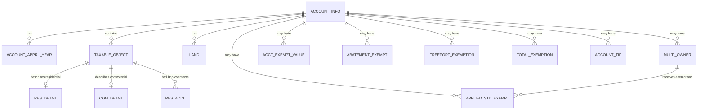

# DCAD Appraisal Database Entity Relationship Diagram

## Overview
The DCAD (Dallas Central Appraisal District) database contains property appraisal data organized into 14 interconnected tables. The database tracks property information, ownership, values, exemptions, and tax-related data.

## Core Entities

### 1. ACCOUNT_INFO (Property & Owner Information)
**Primary Key**: `ACCOUNT_NUM`, `APPRAISAL_YR`

| Column | Type | Description |
|--------|------|-------------|
| ACCOUNT_NUM | String | Unique property account identifier |
| APPRAISAL_YR | Year | Appraisal year |
| OWNER_NAME1, OWNER_NAME2 | String | Primary owner names |
| BIZ_NAME | String | Business name (if applicable) |
| OWNER_ADDRESS_* | String | Owner mailing address fields |
| STREET_NUM, FULL_STREET_NAME | String | Property street address |
| PROPERTY_CITY, PROPERTY_ZIPCODE | String | Property location |
| LEGAL1-5 | String | Legal description |
| DEED_TXFR_DATE | Date | Deed transfer date |
| GIS_PARCEL_ID | String | GIS parcel identifier |

### 2. ACCOUNT_APPRL_YEAR (Annual Appraisal Values)
**Primary Key**: `ACCOUNT_NUM`, `APPRAISAL_YR`
**Foreign Key**: References `ACCOUNT_INFO`

| Column | Type | Description |
|--------|------|-------------|
| IMPR_VAL | Currency | Improvement value |
| LAND_VAL | Currency | Land value |
| TOT_VAL | Currency | Total market value |
| CITY_TAXABLE_VAL | Currency | Taxable value for city |
| COUNTY_TAXABLE_VAL | Currency | Taxable value for county |
| ISD_TAXABLE_VAL | Currency | Taxable value for school district |
| *_JURIS_DESC | String | Jurisdiction descriptions |
| *_SPLIT_PCT | Percent | Jurisdiction split percentages |

### 3. TAXABLE_OBJECT (Property Component Mapping)
**Primary Key**: `ACCOUNT_NUM`, `APPRAISAL_YR`, `TAX_OBJ_ID`
**Foreign Key**: `ACCOUNT_NUM`, `APPRAISAL_YR` references `ACCOUNT_INFO`

Links accounts to specific taxable objects (buildings, improvements).

### 4. RES_DETAIL (Residential Property Details)
**Primary Key**: `ACCOUNT_NUM`, `APPRAISAL_YR`, `TAX_OBJ_ID`
**Foreign Key**: References `TAXABLE_OBJECT`

| Column | Type | Description |
|--------|------|-------------|
| BLDG_CLASS_DESC | String | Building classification |
| YR_BUILT, EFF_YR_BUILT | Year | Construction years |
| TOT_LIVING_AREA_SF | Number | Total living area |
| NUM_BEDROOMS, NUM_*_BATHS | Number | Room counts |
| HEATING_TYP_DESC, AC_TYP_DESC | String | HVAC types |
| POOL_IND, SPA_IND | Boolean | Amenity indicators |

### 5. COM_DETAIL (Commercial Property Details)
**Primary Key**: `TAX_OBJ_ID`, `ACCOUNT_NUM`, `APPRAISAL_YR`
**Foreign Key**: References `TAXABLE_OBJECT`

| Column | Type | Description |
|--------|------|-------------|
| PROPERTY_NAME | String | Property name |
| GROSS_BLDG_AREA | Number | Gross building area |
| NET_LEASE_AREA | Number | Leasable area |
| NUM_UNITS | Number | Number of units |
| IMP_VAL, LAND_VAL, MKT_VAL | Currency | Value components |

### 6. LAND (Land Parcels)
**Primary Key**: `ACCOUNT_NUM`, `APPRAISAL_YR`, `SECTION_NUM`
**Foreign Key**: `ACCOUNT_NUM`, `APPRAISAL_YR` references `ACCOUNT_INFO`

| Column | Type | Description |
|--------|------|-------------|
| SPTD_CD, SPTD_DESC | String | State property type code |
| ZONING | String | Zoning designation |
| AREA_SIZE | Number | Parcel area |
| VAL_AMT | Currency | Land value |
| AG_USE_IND | Boolean | Agricultural use indicator |

### 7. RES_ADDL (Additional Residential Improvements)
**Primary Key**: `ACCOUNT_NUM`, `APPRAISAL_YR`, `TAX_OBJ_ID`, `SEQ_NUM`
**Foreign Key**: References `TAXABLE_OBJECT`

Tracks garages, pools, outbuildings, and other improvements.

## Ownership & Multi-Owner Support

### 8. MULTI_OWNER
**Primary Key**: `APPRAISAL_YR`, `ACCOUNT_NUM`, `OWNER_SEQ_NUM`
**Foreign Key**: `ACCOUNT_NUM`, `APPRAISAL_YR` references `ACCOUNT_INFO`

Handles properties with multiple owners and their ownership percentages.

## Exemption Tables

### 9. APPLIED_STD_EXEMPT (Standard Exemptions)
**Primary Key**: `ACCOUNT_NUM`, `APPRAISAL_YR`, `OWNER_SEQ_NUM`
**Foreign Key**: References `ACCOUNT_INFO` and `MULTI_OWNER`

Tracks homestead, over-65, disabled, and veteran exemptions with ceiling values.

### 10. ACCT_EXEMPT_VALUE (Exemption Values by Type)
**Primary Key**: `ACCOUNT_NUM`, `APPRAISAL_YR`, `EXEMPTION_CD`
**Foreign Key**: `ACCOUNT_NUM`, `APPRAISAL_YR` references `ACCOUNT_INFO`

Stores exemption amounts by jurisdiction and exemption type.

### 11. ABATEMENT_EXEMPT (Tax Abatements)
**Primary Key**: `ACCOUNT_NUM`, `APPRAISAL_YR`
**Foreign Key**: References `ACCOUNT_INFO`

Tracks tax abatements with effective/expiration years and percentages by jurisdiction.

### 12. FREEPORT_EXEMPTION
**Primary Key**: `APPRAISAL_YR`, `ACCOUNT_NUM`
**Foreign Key**: References `ACCOUNT_INFO`

Simple tracking of Freeport exemptions.

### 13. TOTAL_EXEMPTION
**Primary Key**: `ACCOUNT_NUM`, `APPRAISAL_YR`
**Foreign Key**: References `ACCOUNT_INFO`

Minimal table marking accounts with total exemptions.

## Special Districts

### 14. ACCOUNT_TIF (Tax Increment Financing)
**Primary Key**: `ACCOUNT_NUM`, `APPRAISAL_YR`
**Foreign Key**: References `ACCOUNT_INFO`

Tracks TIF zones with base values and percentages by jurisdiction.

## Entity Relationships

## Key Relationships

1. **One-to-Many**: Each account can have multiple years of appraisal data
2. **One-to-Many**: Each account can have multiple taxable objects (buildings/improvements)
3. **One-to-Many**: Each account can have multiple land parcels
4. **One-to-Many**: Each account can have multiple owners (via MULTI_OWNER)
5. **One-to-One**: Each taxable object is either residential OR commercial
6. **One-to-Many**: Each taxable object can have multiple additional improvements

## Common Query Patterns

1. **Current Property Value**: Join ACCOUNT_INFO → ACCOUNT_APPRL_YEAR for latest year
2. **Property Details**: Join through TAXABLE_OBJECT to RES_DETAIL or COM_DETAIL
3. **Total Exemptions**: Aggregate from multiple exemption tables
4. **Owner Information**: Check both ACCOUNT_INFO and MULTI_OWNER tables
5. **Complete Property Picture**: Join property details, land, improvements, and exemptions